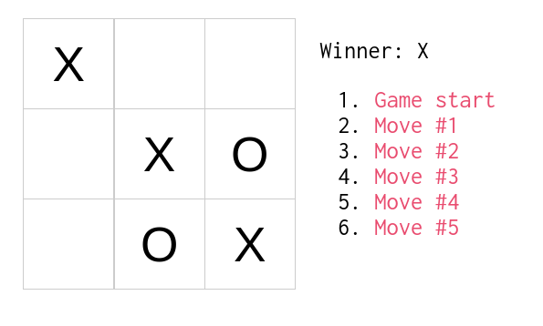

# React Tic Tac Toe

This is my own version of the [React Tic Tac Toe Tutorial](https://facebook.github.io/react/tutorial/tutorial.html). 



## How to run locally

Install node.js, gulp and bower

```
$ npm install
$ npm install -g gulp
```
### For development

Serve the application with gulp:

```
$ gulp serve
```

A new tab in your browser should be opened with the following url:

```
http://localhost:3000
```

### For production

Run:

```
$ gulp
```

This will put all important files in the `dist` directory.
